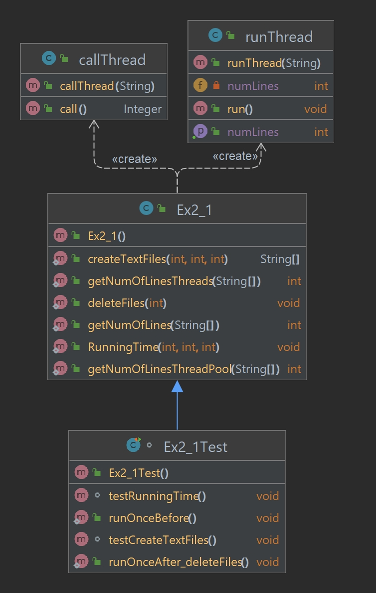

# Threads - Assignment 2

#### By : Zohar Simhon, ID:211871868  and  Linor Ronen, ID:322216045

## **Main topics in this assignment**
* ###  Threads
* ###  ThreadPool
* ### Other interfaces we used

### Threads
Thread allows a program to operate more efficiently by doing multiple things at the same time.
in addition, threads can be used to perform complicated tasks in the background without interrupting the main program.

<u>There are two ways to create a thread:</u>
* It can be created by extending the Thread class and overriding its run() method.
* Another way to create a thread is to implement the Runnable interface.

<u> Running Threads:</u>

* If the class extends the Thread class, the thread can be run by creating an instance of the class and call its start() method.
* If the class implements the Runnable interface, the thread can be run by passing an instance of the class to a Thread object's
  constructor and then calling the thread's start() method.

### ThreadPool
Java Thread pool represents a group of worker threads that are waiting for the job and reused many times.
In the case of a thread pool, a group of fixed-size threads is created. A thread from the thread pool is pulled out and
assigned a job by the service provider. After completion of the job, the thread is contained in the thread pool again.

<u> Thread Pool Methods: </u>

* One of the thread Pool Methods is : newFixedThreadPool(int n) that creates a thread pool of the fixed size n.
  This method belongs to the Executors class which provides static services for creating thread pools.
* Second, the method newCachedThreadPool() : Creates a thread pool that creates new threads as needed,
  but will reuse previously constructed threads when they are available. Also, this method belongs to the Executors class.

<u> Interface ExecutorService: </u>

An Executor that provides methods to manage termination and methods that can produce a Future for tracking progress of
one or more asynchronous tasks. An ExecutorService can be shut down, which will cause it to reject new tasks.
Two different methods are provided for shutting down an ExecutorService: the method shutdown() and the method shutdownNow().
* The shutdown() method doesn't cause immediate destruction of the ExecutorService. It will make the ExecutorService stop accepting
  new tasks and shut down after all running threads finish their current work.
* The shutdownNow() method tries to destroy the ExecutorService immediately, but it doesn't guarantee that all the running threads
  will be stopped at the same time.
* Method submit extends base method Executor.execute(java.lang.Runnable) by creating and returning a Future that can be used to
  cancel execution and/or wait for completion.

<u> Other interfaces we used:</u>

* `Future<T> interface` - generic interface that represents future results of the thread run.
* `Callable<T> interface` - the Callable interface is a generic interface containing a single call() method that returns a generic value.
  A Runnable, however, does not return a result and cannot throw a checked exception.
* `Runnable interface` -the Runnable interface is a functional interface and has a single run() method that
  doesn't accept any parameters or return any values.

### This assignment is divided into two parts: Part 1 and Part 2

# **Description - Part 1**

## The classes:
* Ex2_1 class 
* Ex2_1Test class 
* runThread class
* callThread class

### Ex2_1 class
<u> In this class we used three methods: </u>  

* Standard method without using threads.
* Using threads.
* Using ThreadPool.

<u> In this class we implement four methods: </u>

1. public static String[] createTextFiles(int n, int seed, int bound) - this method creates n text files on disk and returns an array of file names.
2. public static int getNumOfLines(String[] fileNames) - This method accepts an array that contains the file names (fileNames) and returns the total
   number of lines of files (without using threads).
3. public int getNumOfLinesThreads(String[] fileNames) - This method accepts an array that contains the file names (fileNames) and returns the total
   number of lines of files (Using threads).
4. public int getNumOfLinesThreadPool(String[] fileNames) -This method accepts an array that contains the file names (fileNames) and returns the total
   number of lines of files (Using ThreadPool).

### runThread class 
The class runThread extends the class Thread.
The Runnable interface should be implemented by any class whose instances are intended to be executed by a thread.
The class must define a method of no arguments called run.
When an object implementing interface Runnable is used to create a thread, starting the thread causes the object's
run method to be called in that separately executing thread.

<u> In this class we define:</u>

* private String nameOfFile; - the name of the file
* private int numLines; - number of lines in a file

<u> The methods that we have realized in this class are: </u>
* public runThread(String nameOfFile)- a constructive method in this class that accepts the file name.
* public int getNumLines()- return the value of the variable numLines.
* public void run()- a method that calculates the number of lines of the file.

### callThread class 
The class callThread implements the interface Callable.
The Callable interface is a generic interface containing a single call() method that returns a generic value.
The result of call() method is returned within a Future object.

<u> In this class we define: </u>

* private String nameOfFile; - the name of the file
* private int numOfLines; - number of lines in a file

<u> The methods that we have realized in this class are: </u>
* public callThread(String nameOfFile)- a constructive method in this class that accepts the file name.
* public Integer call() - this method calculates the number of lines of the file.

### Ex2_1Test class 
A test class is a normal Java class that is either public or package private.
A test method is a method that isn't private and doesn't return anything.
In our assignment we create test class with JUnit 5.

JUnit 5:
An open and free tool for unit testing in java programming language.
This tool gives us the ability to run the tests automatically.

In this class we make sure that the methods which we have created are doing well.  
Also, we check the runtime of those methods.

## Comparing the runtimes of the methods

##### The methods:

* public static int getNumOfLines(String[] fileNames) - Method number 2
* getNumOfLinesThreads(String[] fileNames) - Method number 3
* getNumOfLinesThreadPool(String[] fileNames) - Method number 4

##### Explanation:

| Number of files | Method 2: getNumOfLines | Method 3: getNumOfLinesThreads | Method 4: getNumOfLinesThreadPool |
|:---------------:|:-----------------------:|:------------------------------:|:---------------------------------:|
|       100       |    4065  millisecond    |         52 millisecond         |          65  millisecond          |
|       500       |    21314 millisecond    |        312 millisecond         |          299 millisecond          |
|      1000       |    44515 millisecond    |        838 millisecond         |          863 millisecond          |

You can see in the table that in the column for a second method the times came out highest.  
This method does not use thread and ThreadPool so this method runs synchronously . In fact when we're using a thread or ThreadPool
you can get better runtimes.
Threads allow a program to operate more efficiently by doing multiple things at the same time
and can be used to perform complicated tasks in the background without interrupting the main program.
That is, using threads allows the user to get the result of the method faster.
Another benefit of using a threads is that threads use shared memory, but they act independently hence if there is an exception in threads that do not affect
the working of other threads despite them sharing the same memory.

<u>Another important point:</u>  
In Java, threads are mapped to system-level threads, which are the operating system's resources.
If we create threads uncontrollably, we may run out of these resources quickly.
The Thread Pool pattern helps to save resources in a multithreaded application and to contain the
parallelism in certain predefined limits.

In addition, you can see that there is no consistency in the columns of methods three and four.
For 100 files and 1000 files the runtime of method 4 is longer than for method 3 and for 500 files
the runtime of method 4 is shorter than for method 3.  
This is because the runtime of the methods which using threads depend on the system and optimization.

## UML
## 

## Download & run the program

### In order to run this project follow this steps:

1. Download zip from our repository.
2. Extract all the files on yor computer and open a new java project.
3. Open the file in your java's workspace.
4. Choose the Ex2_1 class.
5. Finally, run the project.

# **Description - Part 2**

### Background

In Java language there is no built-in option to prioritize an asynchronous task.
The language allows you to prioritize the thread that runs a task but not the task itself.
That's why we'll run into a problem when we want to prioritize an asynchronous task using:
Callable<V> and ThreadPool.

### The purpose of this part
Create a new type that represents an asynchronous task with priority and a new type of thread-pool
that supports priority tasks.

## The classes
* TaskType class
* Task class 
* CustomExecutor class 
* Tests class

### TaskType class 

This class present the enum TaskType which describes the type of task and its priority
(based on the numerical value of the task type).

<u>The types of tasks and their priorities:</u>
* `COMPUTATIONAL` - represents priority 1
* `IO` - represents priority 2
* `OTHER` - represents priority 3

#### The methods that are defined in this class:
* private TaskType(int priority) - a constructive method.
* public void setPriority(int priority) - updates the value of typePriority.
  to the value obtained in the method (priority)  if the value is valid.
* public int getPriorityValue() - return the value of typePriority.
* public TaskType getType() - return the object TaskType.
* private static boolean validatePriority(int priority) - return whether the priority is valid or not.

### Task class 

The class represents operation that can be run asynchronously and can return any kind of value (operation with priority).
The operation does not have to succeed and in case of failure an exception will be thrown.
This class implements the Comparable<Task<T>> interface and the Callable<T> interface.
In addition, this class inherits attributes and methods from the FutureTask<T> class.

#### In this class we define:
* private TaskType typePriority - represents the priority of the task.
* private Callable<T> tCallable - represents the function of the task.
* private boolean isWaiting - represents whether the task is waiting in the queue or not.

#### The methods:
* private Task(TaskType typePriority, Callable<T> tCallable)
* private Task(Callable<T> tCallable)
* public <T> Callable<T> getCallable()
* public TaskType getTypePriority()
* public boolean getISWaiting ()
* public void setCallable(Callable<T> tCallable)
* public void setISWaiting (boolean isWaiting)
* public void setTypePriority(TaskType typePriority)
* public static <T> Task<T> createTask(Callable<T> tCallable, TaskType typePriority)
* public static <T> Task<T> createTask(Callable<T> tCallable)
* public int priorityValue()
* public T call()
* public int compareTo(Task<T> other)
* public boolean equals(Object o)
* public int hashCode()

### class CustomExecutor
This class represents a new type of ThreadPoolExecutor that supports a priority queue tasks
(each task in the queue is of type Task).
This class inherits attributes and methods from the ThreadPoolExecutor class.

#### In this class we define:
* private static int NumOfCores - represents the number of cores which available for the Java Virtual Machine.
* private int [] counterType - represents the number of tasks in each priority.

#### The methods:
* public CustomExecutor()
* public int[] getCounterType()
* public int getCurrentMax()
* public <T> Future<T> submit (Task<T> task)
* public <T> Future<T> submit (Callable<T> tCallable, TaskType typePriority)
* public <T> Future<T> submit (Callable<T> tCallable)
* protected void beforeExecute(Thread t, Runnable r)
* protected <T> RunnableFuture<T> newTaskFor(Callable<T> callable)
* public void gracefullyTerminate()
* public boolean equals(Object o)
* public int hashCode()

### Tests class 
A test class is a normal Java class that is either public or package private.
A test method is a method that isn't private and doesn't return anything.
In our assignment we create test class with JUnit 5.

JUnit 5:
An open and free tool for unit testing in java programming language.
This tool gives us the ability to run the tests automatically.

In this class we make sure that the methods which we have created are doing well.

## Download & run the program

#### In order to run this project follow this steps:

1. Download zip from our repository.
2. Extract all the files on yor computer and open a new java project.
3. Open the file in your java's workspace.
4. Make your own main.
5. Finally, you can run the main or the test class.

## UML
## 

